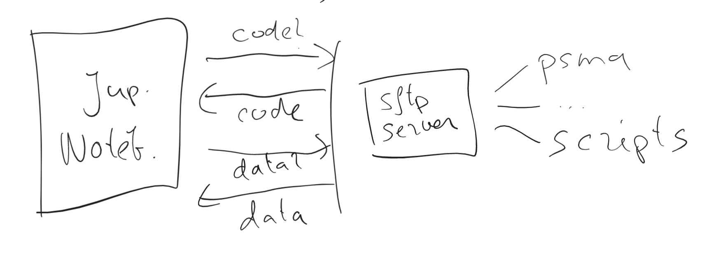
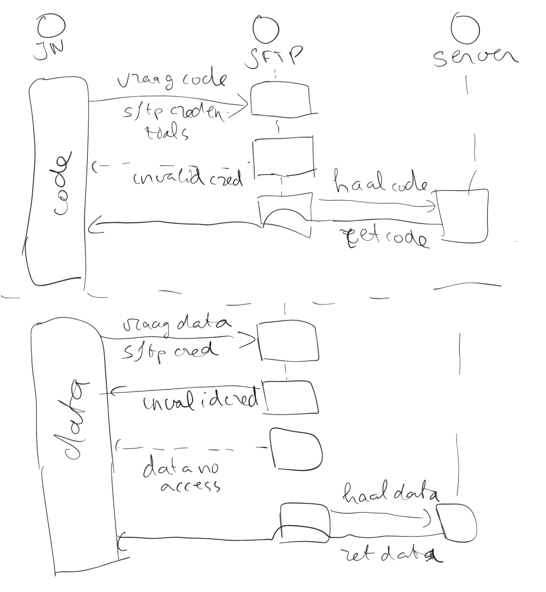

# Aanleiding
Werken met persoonlijke data is gebonden aan veel regels en procedures. De data moet anoniem gemaakt worden, een Data Transfer Agreement tussen Windesheim en Isala moet worden opgesteld, en de studenten moeten alleen tijdens het project toegang hebben tot de data. 

Een gangbare manier om dit soort data beschikbaar te stellen is door het simpelweg naar de studenten te mailen. Dit heeft als nadeel dat de data nu in de mnailbox staat van elke student. Sterker nog, als de student daadwerkelijk aan de slag wil met de data moet het ook nog op de laptop van de student opgeslagen worden. Dit vergroot alleen nog maar het aantal plekken waar de data komt te staan. Dit vergroot de kans dat iemand in deze keten vergeet de data te verwijderen uit zijn of haar mailbox of harde schijf. 

Dit ontwerpdocument beschrijft een alternatieve manier om de data naar de student te krijgen, zonder dat dit de nadelen heeft van bestaande systemen. 

# Functionele eisen
Om verder uit te diepen wat onze behoeftes zijn hebben we de volgende use case uitgewerkt. De beperkte scope van het systeem maakt het mogelijk om alle functionele eise onder 1 use case samen te vatten. Er zijn twee actoren actief in dit systeem:

- *de onderzoeker* deze persoon heeft een onderzoeksdoel waarvoor typisch een stuk data geanalyseerd wordt, en wat resulteerd in een ML model wat dit onderzoeksdoel dient. Gedacht kan worden aan een ML model wat een risicoinschatting kan maken voor een patient op basis van een aantal gegevens van deze patient. 
- *de student* deze persoon werkt onder leiding van de onderzoeker aan het ML model. Hiervoor is het natuurlijk nodig dat hij/zij toegang heeft tot de data. Onze aanname is dat deze student in Python werkt, en meer specifiek door gebruik te maken van een zogenaamd [Jupyter Notebook](https://jupyter.org/). 

**TODO: Hier eventueel domeinmodel?**

De volgende twee use cases beschrijven de tool vanuit deze twee perspectieven:

### Use case 1: data beschikbaar maken
*User story:* Als docent wil ik op een veilige manier mijn studenten toegang geven tot de persoonlijke data zodat zij hun onderzoek kunnen uitvoeren

Acceptatiecriteria:

- AC1: de student moet alleen toegang krijgen tot de data waar hij/zij rechten voor heeft
- AC2: De student krijgt de data terug in een Pandas DataFrame. Andere details die nodig zijn voor het verwerken van de data zoals passwords voor Excel files moeten niet zichtbaar zijn voor studenten. 
- AC3: de data wordt *niet* op de hardeschijf van de studenten opgeslagen, zodra de Jupyter Kernel afgesloten wordt moet de data weg zijn
- AC6: AC5 is onder voorwaarde data de beveiliging in lijn is met de industriestandaard voor dit soort online services
- AC7: identificatie zoals passwords moeten niet hard in de broncode van de studenten staan. 

### Use case 2: met de data werken
*User story:* als student wil ik toegang hebben tot de persoonlijke data zodat ik mijn onderzoek kan uitvoeren.

Acceptatiecriteria:

- AC4: de student moet met de data kunnen werken zonder een netwerkverbinding, alleen bij het inladen is netwerk nodig
- AC5: de student moet de data kunnen inladen vanaf elke plek met een netwerk verbinding, niet alleen vanuit Windesheim of Isala bijvoorbeeld.
- AC8: de werkwijze moet goed aansluiten bij de standaardwerkwijze die de student aangeleerd krijgt in het vak: pandas, Jupyter Notebook, Python. De werkwijze moet dus ook niet erg ingewikkeld zijn voor de studenten.  

# De technische oplossing
We hebben ervoor gekomzen om de data op te slaan op een SFTP server, waarvan de studenten de data in kunnen laden naar hun Jupyter notebook. De technische opbouw ziet er als volgt uit:

Het volgende sequence diagram laat zien hoe de workflow rondom dit systeem in de praktijk werkt:

De keuze om een SFTP server te kiezen als data backend is een pragmatische keuze:
- We zijn bekend met hoe SFTP werkt en hoe dit geconfigureerd moet worden
- Het is een basic tool die eigenlijk alles kan wat we nodig hebben. 
- De alternatieven waren allemaal veel meer werk

**TODO**: breid bovenstaande redenatie uit: Vraag dit aan Gido, hij heeft de keuzes gemaakt.

Er zijn dus twee fases: code ophalen voor data lezen, en daadwerkelijk data lezen. We hebben deze tweetrapsraket gekozen zodat de student alleen maar de data ophaalt, en geen details ziet hoe de data ingelezen en verwerkt wordt (AC2). De code voor het ophalen van de data kun je vinden in `module_loading_functions.py`, de code voor het ophalen van de data kun je vinden in `data_loading_functions.py`. 

Het inlezen van de data vanaf de SFTP server naar een pandas dataframe zorgt ervoor dat de data dus niet op de hardschijf van de student komt te staan (AC3). De student zou de data alsnog op de hardschijf kunnen opslaan, maar dit zou een bewuste stap van de student zijn die tegen de afspraken in ging. Dit in contrast met de oude situatie, waar de standaard sitautie was dat de data bij elke individuele student op de hardschijf staat. 

In de volgende secties werken we verder uit welke keuzes we gemaakt hebben in de onderdelen van het systeem.

### Code ophalen
Het ophalen van de code gebeurt via `module_loading_functions.py`, dit bestand moet klaar staan in de $lokale$ werkdirectory van de studenten. De volgende code moet dan uitgevoerd worden in het Jupyter Notebook:

    from module_loading_functions import get_vicodin_module

    data_loading_module = get_vicodin_module('scripts/data_loading_functions.py')

De functies in `data_loading_functions.py` zijn nu beschikbaar om aan te roepen, bijvoorbeeld:

    test_data = data_loading_module.get_test_file()

Bij het ophalen van de code bouwen we een SSH verbinding op waarover we het FTP protocol draaien. Dit is in essentie wat SFTP is. De SFTP account (username/password) bepaald of de student uberhaupt toegang krijgt (AC6), en zo ja, welke directories toegankelijk zijn (AC1). Naast de data moet ook elke groep toegang hebben tot een `scripts` subdirectory waar oa `data_loading_functions.py` klaar staat. De code gaat ervan uit dat de SFTP server op de juiste manier geconfigureerd is, zie ook het kopje `Data storage via SFTP`. 

De SFTP credentials (username/password) worden opgeslagen in een `.env` bestandje, dit om te voorkomen dat SFTP credentials hard in de code staan (AC7). De code pikt deze op uit het bestandje voordat de SFTP verbinding aangemaakt wordt. De student moet ervoor zorgen dat dit `.env` bestandje in de lokale werkdirectory staat. Voor het laden van het `.env` bestandje gebruiken we de `dotenv` library, deze laad `SETTING = "WAARDE"` paren uit het `.env` bestandje en stelt ze als environment variabelen beschikbaar. Deze kunnen wij dan weer oppikken door middel van `os.getenv`. De volgende entries moeten aanwezig zijn in de `.env` file:

    SFTP_HOSTNAME='xxxx.xxxx.xxx.xx'
    SFTP_USERNAME='name'
    SFTP_PASSWORD='password'

Nergens in de code worden deze waardes in de interfaces van de functies doorgegeven, de code gebruikt de waardes die uitgelezen worden uit het `.env` bestand. Dit maakt de interface simpeler, maar zorgt er ook voor dat de code niet zomaar gebruikt kan worden buiten de context van `module_loading_functions.py`. 

**TODO**: verwerk onderstaand in het design

    De groep gaf aan dat er een permissionprobleem was met de temp file. Het lag aan dit ding: https://stackoverflow.com/a/23212515/1033808. 

    De oplossing was om de file handmatig lokaal in te laden, dit had niet last van de permission bug. 

### Data ophalen
Elke dataset die via `data_loading_functions.py` beschikbaar gesteld wordt heeft een `get` functie (bv `get_psma_data`) die een pandas dataframe teruggeeft (AC2). Onder de moterkap gebeurt er het volgende:

- De `get` functie roept `get_vicodin_module` aan
- deze maakt een SFTP verbinding naar de server
- het bestand wat aan `get_vicodin_module` gevraagd wordt, als het bestaat, wordt in een BytesIO stream gestopt
- Deze BytesIO stream wordt door een loader functie getrokken die er een Pandas DataFrame van maakt. 
- Zodra het pandas dataframe in het geheugen staat wordt de SFTP connectie afgesloten en is er geen netwerk verbinding naar de server meer nodig (AC4). 

Deze setup zorgt ervoor dat `get_vicodin_data` generiek is en dat je alleen nog maar een file op de SFTP server en een bijbehorende load functie in hoeft te stellen voor elke dataset die je bloot wil stellen. Dit wordt versterkt door het gebruik van een BytesIO stream: de code is exact hetzelfde of het bestand nu een csv, Excel of andere file is. Zolang de loader functie maar een pandas dataframe maakt van de BytesIO stream. 

De volgende getter leest een excel file in:

    def get_excel_dataset():
        return get_vicodin_data('file.xlsx', loader_function=pd.read_excel)

**Get functies als configuratie**

Get functies bevatten soms gevoelige informatie zoals wachtwoorden van Excel files. Zie bijvoorbeelde deze getter:

    def psma_loader(byte_io):
        return pd.read_excel(decrypt_excel_bytes(byte_io, password='xxxx'), sheet_name='Data', nrows=60, skiprows=1)

Die via de helper functie `decrypt_excel_bytes` uit `data_loading_functions.py` een encrypted excel file opent. Deze loaders en getters zijn dus niet iets wat we in dit `sftp_tool` willen opslaan, maar iets wat los als configuratie wordt toegevoegd. Hoe het werkt is dat `data_loading_functions.py` zoekt naar een bestand wat `local_getters.py` heet in zijn locale directory. Als dit aanwezig is worden de getters en loaders uit deze file geladen, en beschikbaar gesteld voor de gebruiker. 

Let op dat je in `local_getters` eventueel ook zaken vanuit `data_loading_functions.py` moet laden, bijvoorbeeld de `decrypt_excel_bytes` functie. Dit betekend dat er een circulaire afhankelijkheid is tussen deze twee files, wat in principe niet ideaal is. Maar in dit geval is de codebase erg klein, en is dit een mooie oplossing. 

**Functionele stijl**
*TODO: willen we dit niet helemaal weglaten?* 

Voor het configureren van de get functies is het mogelijk om een functionele stijl te gebruiken. Dit om de hoeveelheid boilerplate code te minimaliseren. Een goed voorbeeld is het PSMA getter/loader functie paar:

    psma_loader = compose(partial(decrypt_excel_bytes, password="xxxxxx"),
                        partial(pd.read_excel, sheet_name='Data', nrows=60, skiprows=1))
    get_psma_file = partial(get_vicodin_data, 'database_psma_met_functies.xlsm', loader_function=psma_loader)

`partial` geeft als return waarde een nieuwe functie terug waar de defaults van de input parameters zijn vervangen. `get_psma_file` is dus `get_vicodin_data` waar het eerste invoer argument `database_psma_met_functies.xlsm` is en het tweede invoer argument de bijbehorende loader. Nu kun je `get_psma_file` aanroepen, en worden deze defaults gebruikt. `partial` roept dus *niet* `get_vicodin_data` aan, maar creeert een variant van de functie met nieuwe default waardes voor de functie inputs. 

Voor de loader functie combineren we partial nog met compose. Dit is nodig om de loader twee stappen moet uitvoeren: het decrypten van de Excel sheet, en daarna het omzetten van deze sheet naar een pandas dataframe. `compose` geeft net als `partial` een functie terug, die in dit geval de twee taken achter elkaar uitvoert. 

Door op deze manier functioneel programmeren in te zetten kun je de getters en loaders maken door een set aan functies te configureren (`partial`) en aan elkaar te rijgen (`compose`). 

### Data storage via SFTP
Deze sectie ligt toe hoe de SFTP server geconfigureerd is. 

**TODO**: kijk hier samen met Gido naar om vast te leggen hoe de SFTP precies geconfigureerd moet worden.

Een SFTP server zorgt ervoor dat de data alleen toegankelijk is voor personen met de juiste credentials, en de communicatie met de server is onder strikte encryptie (AC6). Per project wordt een directory aangemaakt waar de specifieke data voor de studenten klaar gezet wordt. In de `scripts` directory staat de code klaar die de studenten nodig hebben om de data daadwerkelijk in te lezen. 

- Elke nieuwe studentgroep heeft een eigen `.env` bestand waarin hun credentials staan
- Server waar SFTP op staat moet openstaan op poort 22 (AC5)
- Op de server is een groep genaamd `students`. Bestanden die we delen moeten de owner `root:students` hebben, denk hierom als je niet bestanden klaar zet op de SFTP server. 

- De SFTP server is geconfigureerd door gebruik te maken van een virtual root. Dit zorgt ervoor dat studenten alleen de spullen die ook daadwerkelijk te zien zijn. (AC1)
- De link naar de scripts directory werkt niet met een softlink, dus dit moet via een mount. 

### Hoe ziet dit er nu in de praktijk uit
*TODO: breidt uit*

- `data_loading_functions.py` en `local_getters.py` staan op de SFTP server
- `module_loading_functions.py` en `.env` file bestaan lokaal. Je geeft deze aan studenten die vervolgens de data kunnen inlezen via

*todo: vul code aan*

# Onderhoudstaken
### Toevoegen nieuwe studentengroep
**TODO** vul aan

- Aanmaken van een SFTP account voor de groep
- `.env` bestand maken met de SFTP credentials
- Klaarzetten van de relevante data

### Toevoegen nieuwe dataset aan `data_loading_functions.py`
Ik ga er hier vanuit dat de data al klaar staat in de juiste directory op de SFTP server, zie ook `Uploaden van nieuwe data naar SFTP` hieronder. 

Als de loader functie voor de nieuwe data een standaard pandas functie waar ook geen default argumenten anders moeten dan kun je direct een getter schrijven:

    get_new_file = partial(get_vicodin_data, 'new_data.csv', load_function=pd.read_csv)

hier is het bestand een csv file die gewoon met een call naar `pd.read_csv` ingelezen wordt. Het kan zijn dat je meer acties moet doen, bijvoorbeeld zoals hier:

    psma_loader = compose(partial(decrypt_excel_bytes, password="xxxxx"),
                        partial(pd.read_excel, sheet_name='Data', nrows=60, skiprows=1))
    get_psma_file = partial(get_vicodin_data, 'database_psma_met_functies.xlsm', loader_function=psma_loader)

waar de loader bestaat uit het decrypten van een Excel file, gevolgd door een wat ingewikkeldere call naar `pd.read_excel`. 

Qua development kun je het beste de volgende stappen volgen:

- Schrijf de code om de data in te leveren los in een Jupyter Notebook, tot het punt dat je het pandas dataframe hebt wat je graag naar de studenten wil sturen. Hier lees je de data nog lokaal in
- Schrijf deze code dan om naar de functionele stijl hierboven, gebruik makende van `get_vicodin_data`. Er vanuit gaande dat de data op de SFTP staat en dat je de juiste `.env` file gebruikt zou dit moeten werken. 
- Als dit ook werkt, zet de code dan in `data_loading_functions.py` file en probeer of het geheel ook goed werkt via `module_loading_functions.py`. Hier is het super handig om `get_vicodin_module` aan te roepen met `local_file="data_loading_functions.py"`. Op die manier kun je de code in `data_loading_functions.py` lokaal tweaken totdat het goed lukt om de data vanaf de SFTP server in te laden. 
- Als dit allemaal goed werkt moet je de code uploaden naar de SFTP server om de nieuwe loader functie beschikbaar te maken. Zie het kopje `Uploaden van nieuwe code` voor details over deze actie. 

### Uploaden van nieuwe code
Zodra de code in `data_loading_functions.py` klaar is voor deployment kun je de volgende stappen nemen:

- Kopieer de code naar de server toe, in ons geval naar onze homedir op Vicodin. Ik ga er hier vanuit dat je een geldige SSH inlog hebt naar de server toe. 

        scp data_loading_functions.py vicodin:~

- kopieer de code naar de `/var/sftp/scripts` directory. Dit zorgt ervoor dat de nieuwe code opgepikt wordt door `module_loading_function.py`. 

        sudo cp ~/data_loading_functions.py /var/sftp/scripts 

- Zet de eigendomsrechten correct. Dit is nodig aangezien de file geupload is door een gebruiker:

        sudo chown root:students /var/sftp/scripts/data_loading_functions.py

    Let erop dat als er al code hier klaar staat dat deze overschreven wordt. 

### Uploaden van nieuwe data naar SFTP
Als de data klaar staat op je lokale PC moet je de volgende stappen uitvoeren om de data beschikbaar te maken aan de studenten:

- Kopieer de data naar de server toe, in ons geval naar onze homedir op Vicodin. Ik ga er hier vanuit dat je een geldige SSH inlog hebt naar de server toe. 

        scp data.csv vicodin:~

- Kopieer de data naar de directory waar de SFTP server kijkt, in ons geval is dit `/var/sftp`. Hier is **cruciaal** dat je de data naar de juiste subdir on `/var/sftp` kopieert omdat dit bepaald welke SFTP credentials bij welke data kunnen. We gaan ervan uit dat het account waar de beschikbaar aan gemaakt moet worden `test_account` heet:

        sudo cp ~/data.csv /var/sftp/test_account
    
    het is heir nodig om `sudo` te gebruiken omdat de standaard gebruiker geen rechten heeft op `/var/sftp`. 

- Zet de eigendomsrechten correct. Dit is nodig aangezien de file geupload is door een gebruiker:

        sudo chown root:students /var/sftp/test_account/data.csv

    Let erop dat als er al een dataset hier klaar staat dat deze overschreven wordt. 

# Test suite
Om zeker te zijn dat onze software voldoet aan de gestelde criteria gaan we een aantal tests opstellen. 

- We werken met het standaard `unittest` framework wat ingebouwd is in Python. Dit betekend dat we verder geen extra packages nodig hebben. 
- De onderstaande tests gaan ervanuit dat je het `psma` account actief hebt in `.env`. 

# AC1: student heeft alleen toegang tot de data waar hij/zij recht op heeft
De tests voor dit AC zijn te vinden in `tests.py` onder `TestPSMAaccount`. Hier wordt getest of:

- Je met de PSMA account de PSMA data kan inlezen
- Je kan met de PSMA account geen lymfoma data inlezen
- Je kan met het PSMA account de test data laden
- Je kunt met PSMA account `dataloading_functions` inladen vanaf de server 

Dit laat in de basis zien dat de tool werkt, en dat je niet per ongeluk de data beschikbaar stelt aan de verkeerde groep. Dit fixt natuurlijk de optie dat er een fout in de code zit, maar **niet** als de spullen onder de verkeerde SFTP account gezet worden. 

# AC2: student krijgt data terug als pandas dataframe
De tests voor AC1 check al expliciet of de data die terugkomt een `pd.DataFrame` zijn, hier hoeven we dus niet een aparte test voor de te maken. 

Verder stelt dit AC nog dat alle details verborgen moeten zijn voor de student die de data inleest. Dit zit inherent in het ontwerp van de tool: alle details zitten in `data_loading_functions.py` en deze wordt alleen via de server ter beschikking gesteld. 
