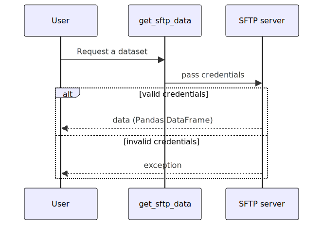
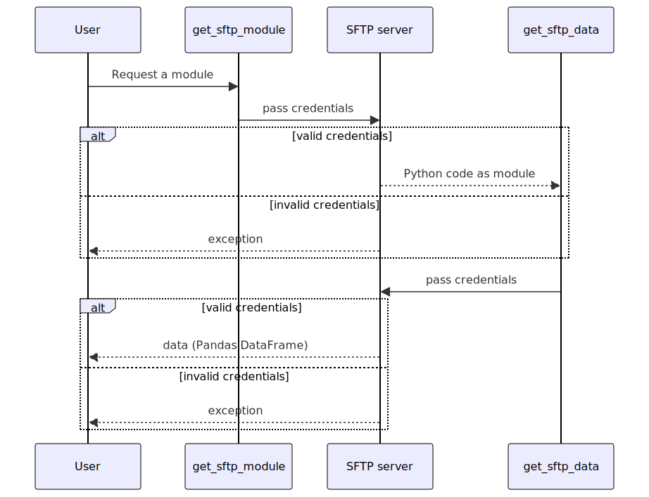

# Introduction
Working with personal data is subject to many rules and procedures. The data must be anonymized, a Data Transfer Agreement between the parties must be drafted, and users should only have access to the data during the project. This is even more pressing in student projects where often a large group of students only has to have access to the data for a limited period of time. 

A common way to make this type of data available is simply by emailing it to the students. However, this has the disadvantage of storing the data in each students's mailbox. Furthermore, if the student wants to work with the data, it also needs to be saved on their laptop. This only increases the number of places where the data is stored. This consequently increases the risk that someone in this chain forgets to delete the data from their mailbox or hard drive.

This design document describes an alternative way to get the data to the student, without the disadvantage of a crude system such as e-mail. 

# Functional requirements
To further elaborate on our needs, we have developed the following use cases. The limited scope of the system allows us to summarize all functional requirements under two use cases. There are two actors active in this system that is aimed at exchanging data between :

- the researcher this person has a research goal for which typically a piece of data is analyzed, resulting in an ML model that serves this research goal. One could think of an ML model that can make a risk assessment for a patient based on a number of this patient's data.
- the user this person works under the guidance of the researcher on the ML model. Of course, it is necessary for him/her to have access to the data. Our assumption is that this user works in Python, and more specifically by using a so-called Jupyter Notebook.

TODO: add domain model?

The following two use cases describe the tool from these two perspectives:

### Use case 1: Making data available
*User story:* As a teacher, I want to give my students access to personal data in a safe way so they can conduct their research

Acceptance criteria:

- AC1: the student should only get access to the data for which he/she has rights
- AC2: The student receives the data back in a Pandas DataFrame. Other details needed for processing the data, such as passwords for Excel files, should not be visible to students.
- AC3: the data is *not* stored on the students' hard drive, as soon as the Jupyter Kernel is closed the data should be gone
- AC6: AC5 is conditional on the security being in line with the industry standard for this kind of online services
- AC7: identification such as passwords should not be hard-coded in the students' source code.
- AC9: the data cannot be stored in any public cloud, only on hardware directly controlled by the researcher

### Use case 2: Working with the data
*User story:* as a student, I want to have access to sensitive data so I can conduct my research.

Acceptance criteria:

- AC4: the student should be able to work with the data without a network connection, only loading the data requires a network
- AC5: the student should be able to load the data from any location with a network connection, not just from the school premises for example.
- AC8: the method should align well with the standard method that the student learns in the course: pandas, Jupyter Notebook, Python. The method should therefore not be very complicated for the students given this context.

# The technical solution
We have to make a number of choices to make this system work:
- Were do we store the data?
- How do we get the data from the data storage to the student?

### Data storage
The core of our data storage solution is an SFTP server where the data is hosted. We chose an SFTP server because:

- We have complete control over the hardware and software that the data is stored on (AC9)
- We have prior experience with SFTP, which made the barrier to entry quite low. 
- Alternatives where much more feature rich, but also much more work to maintain. 

**TODO: Expand the reasoning above**

To access the SFTP server, the student requires valid credentials, a username/password combo in this case. Each user account has a separate storage area on the SFTP server, so the student only has access to the data that is explicitely shared with them (AC1). 

The data stream from the SFTP server to the student is encrypted (AC7). In addition, the SFTP server runs on a Linux machine, which is accessible to the outside world given the student has the correct credentials (AC5). 

For a more in-depth description of how the SFTP server is configured, I refer to the `Common maintanance tasks` section. 

### Getting the data to the student
#### Getting the data
The workhorse functin in the package is the `get_sftp_data` function in [`data_loading_functions.py`](src/sftp_data_provider/data_loading_functions.py). The following sequence diagram describes the flow:

This allows you to specifiy a filename on the server you want to get, and it returns a Pandas DataFrame (AC8). The function first builds up an SSH connection to the SFTP server using the credentials stored in a `.env` file (AC7) that needs to be in the working directory of the student, i.e. the same directory as the Jyputer Notebook they are working in. The `.env` file has the following three variables that need to be set:

    SFTP_HOSTNAME='123.44.55.66.77'
    SFTP_USERNAME='testuser'
    SFTP_PASSWORD='password'

These credentials need to be provided to the student by the researcher. But once these are present, and the package is installed, the following code can be used to load the data into the current Python script or Notebook (AC8):

    from sftp_data_provider import get_sftp_data
    import pandas as pd

    get_sftp_data("data_file.xlsx", pd.read_excel)

here you can see that the function requires two inputs: a file that is to be loaded from the SFTP server, and a load function that converts the contents of that file to a Pandas DataFrame. In this case the loader is quite simply the standard Pandas function to read an Excel file. 

#### Getting the data with an anonymous loader
In the example above, the data loader does not involve any sensitive information. However, the following example does:

    import pandas as pd
    from sftp_data_provider import get_sftp_data , decrypt_excel_bytes

    def psma_loader(bytes_io):
        '''
        Decrypts the BytesIO stream containing the PSMA data and returns a pandas dataframe
        '''
        decrypted = decrypt_excel_bytes(bytes_io, password="password")
        return pd.read_excel(decrypted, sheet_name='Data', nrows=60, skiprows=1)

    def get_psma_file():
        '''The function you can use to get the psma data
        
        The only requirement is to have a valid username and password stored in the .env file
        '''
        return get_sftp_data('database_psma_met_functies.xlsm', loader_function=psma_loader)

specifically the fact that the Excel password is listed here is something we want to hide from the student (AC2). To do this, we can store the code listed above in a Python script file on the SFTP server, say `load_data.py` and use the code from [`module_loading_functions`](src/sftp_data_provider/module_loading_functions.py) like this:

    from sftp_data_provider import get_sftp_module

    data_loading_module = get_sftp_module('load_data.py') 
    data_loading_module.get_psma_file()

This triggers the following workflow:

This first gets the data loading code from the server, and then executes it locally get actually get the data from the SFTP server. This hides any and all details regarding how the data is actually read (AC2). 

### Common maintanance tasks