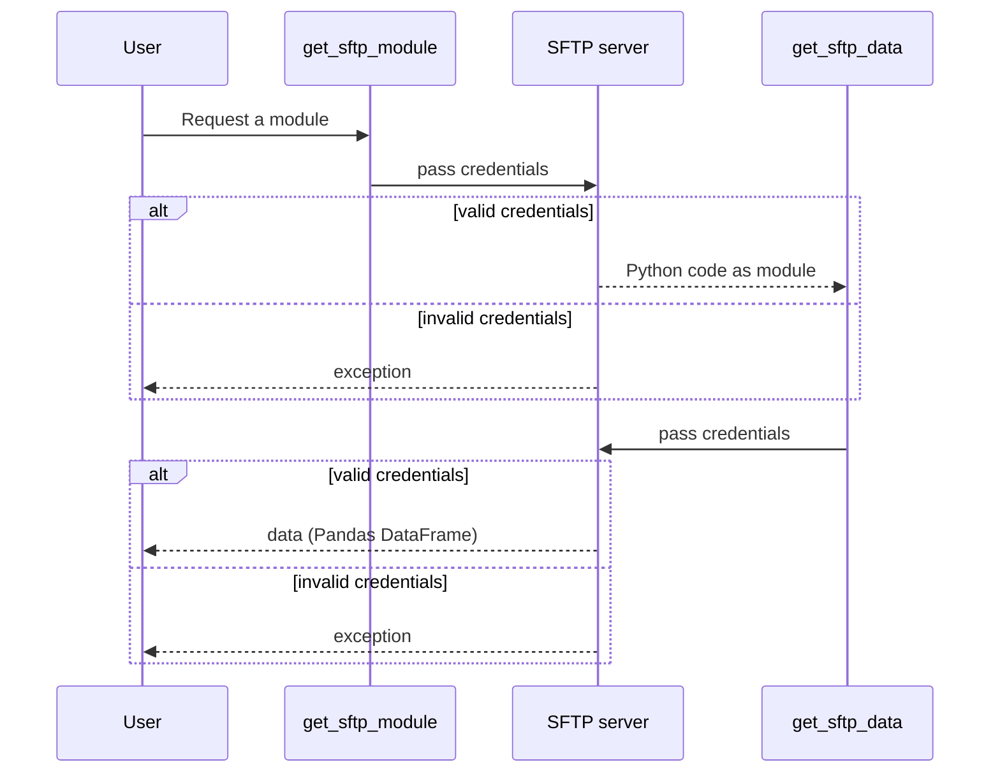

```mermaid
sequenceDiagram
    User->>get_sftp_module: Request a module
    get_sftp_module->>SFTP server: pass credentials
    alt valid credentials
        SFTP server-->>get_sftp_data: Python code as module
    else invalid credentials
        SFTP server-->>User: exception
    end
    get_sftp_data->>SFTP server: pass credentials
    alt valid credentials
        SFTP server-->>User: data (Pandas DataFrame)
    else invalid credentials
        SFTP server-->>User: exception
    end
```